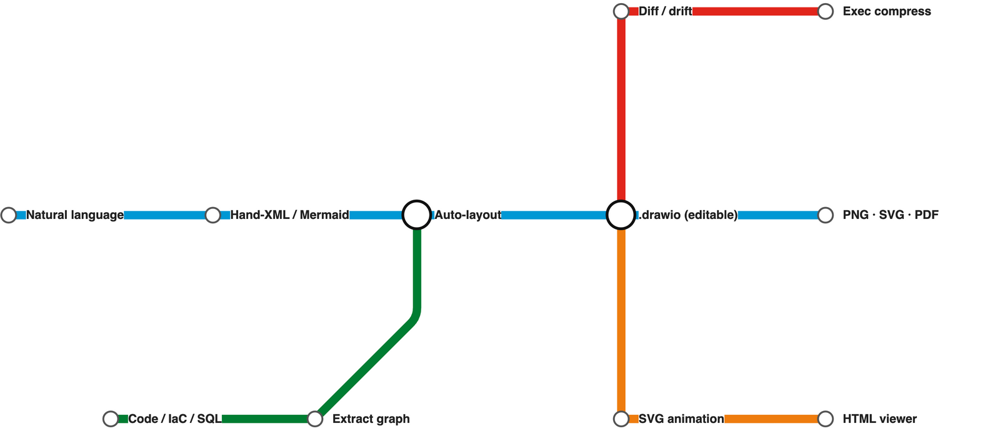

# drawio-skill — From Text to Professional Diagrams

[](LICENSE)
[](https://github.com/Agents365-ai/drawio-skill/stargazers)
[](https://github.com/Agents365-ai/drawio-skill/network/members)
[](https://github.com/Agents365-ai/drawio-skill/releases/latest)
[](https://github.com/Agents365-ai/drawio-skill/commits/main)

[](https://skillsmp.com/skills/agents365-ai-drawio-skill-skills-drawio-skill-skill-md)
[](https://github.com/Agents365-ai/365-skills)
[](https://agentskills.io)

**English** · [中文](README_CN.md) · [📖 Online Docs](https://agents365-ai.github.io/drawio-skill/)

A skill that turns natural language and real system sources into maintainable `.drawio` architecture models. Beyond generation and export, it incrementally synchronizes without discarding manual layout, projects multiple views from one model, enforces architecture contracts, queries dependencies, simulates failure propagation, and publishes dependency-free interactive walkthroughs. Works with **Claude Code, Cursor, Copilot, OpenClaw, Codex, Autohand Code, Hermes**, and any agent compatible with the [Agent Skills](https://agentskills.io) format.

<p align="center">
  
</p>

## ✨ Highlights

**From a prompt**

- **Describe it, get an editable `.drawio`** — the skill plans the layout, writes the XML, exports, then self-checks its own PNG and auto-fixes overlaps, clipped labels, and stacked edges (up to 2 rounds), with up to 5 rounds of your feedback
- **Mermaid → native .drawio** (draw.io ≥ 30) — author 28 standard types as Mermaid text (**mindmap, gantt, timeline, journey, pie, sankey, kanban**…) and the CLI converts them into a laid-out, editable `.drawio`: structure in, layout free
- **Whiteboard photo / screenshot → editable diagram** — snap a legacy PNG or a physical whiteboard, let vision extract the graph, and `raster2drawio.py` rebuilds it as a real, editable `.drawio` honouring the original layout
- **11 diagram type presets** — ERD, UML Class, Sequence, C4, Architecture, ML/Deep Learning, Flowchart, SysML, BPMN, Network Topology, Cross-Functional Swimlane

**From real sources**

- **Visualize a codebase** — import graphs for Python / JS-TS / Go / Rust and Python class hierarchies, with Graphviz placement, transitive reduction, and nested module containers
- **IaC and live infrastructure** — Terraform, Kubernetes, and docker-compose configs become diagrams with official AWS / Azure / GCP / K8s icons; snapshot what's *actually deployed* from `terraform show -json`, `docker inspect`, or `kubectl get -o json`
- **Schemas and pipelines** — SQL DDL → ER diagram, OpenAPI/Swagger → API diagram coloured by HTTP method, GitHub Actions / GitLab CI → pipeline DAG
- **Deterministic engines** — sequence diagrams with computed lifelines and activation bars; multi-page C4 models with click-to-drill-down

**Keep it true over time**

- **Architecture digital twin / Diagram IR** — separate meaning, provenance, and geometry; project executive, system, deployment, data-flow, and security views from one model
- **Incremental sync without losing manual layout** — `diagramctl sync` updates changed nodes/relations while preserving tuned coordinates, styles, and annotations; removals stay reviewable by default
- **Diagram-as-Test, in CI** — YAML/JSON architecture rules (Internet-to-database access, cycles, orphans, trust boundaries, contrast…) plus an official GitHub Action that enforces them on every PR, and a PR action that renders visual diffs
- **Query, review, what-if** — query components/owners/paths, spot articulation points and high coupling, simulate failure propagation, publish an accessible Story walkthrough
- **Drift and history** — colour-coded diffs between two diagrams or two live snapshots; a time-lapse player of how a codebase's architecture grew

**Share and restyle**

- **Repurpose with one command** — interactive HTML viewer (pan/zoom/search), PowerPoint deck, animated data-flow SVG, Mermaid or Markdown export, click-through runbook, exec-summary compression
- **Restyle and enrich** — style presets (yours or built-in `dark`/`corporate`/…), bilingual label variants with layout untouched, data-driven heat maps, white-to-metro tubemap mode
- **10,000+ official shapes + 321 AI/LLM logos** — resolve exact AWS / Cisco / K8s / UML icon styles instead of guessing, plus brand logos draw.io itself lacks
- **One CLI, optional MCP server** — `diagramctl doctor/build/sync/views/query/test/review/whatif/story/publish/transform`, core workflows stdlib-only and offline; the MCP server exposes them to Claude Desktop, Cursor, VS Code, Codex, and any MCP host. Portable to any Agent Skills-compatible agent, no daemon

## 🗺️ Feature Map

<div align="center">
  
</div>

A bird's-eye view of everything the skill does — diagram types, import sources, layout engines, styling, export formats, and repurposing — in one map. Fittingly, this map was itself drawn with drawio-skill.

## 🚀 Installation

### 1. Install the draw.io desktop CLI

| Platform | Command |
| ---------- | --------- |
| **macOS** | `brew install --cask drawio` |
| **Windows** | [Download installer](https://github.com/jgraph/drawio-desktop/releases) |
| **Linux** | `.deb`/`.rpm` from [releases](https://github.com/jgraph/drawio-desktop/releases); `sudo apt install xvfb` for headless |

Verify with `drawio --version`. **Version ≥ 30 recommended** — it unlocks Mermaid → `.drawio` conversion and the ELK `--layout` pass (both unavailable on ≤ 29). On **WSL2** the CLI is the Windows desktop exe reached via `/mnt/c` — the skill detects this automatically (see [troubleshooting](skills/drawio-skill/references/troubleshooting.md)). Full recipes in [docs/INSTALL_CLI.md](docs/INSTALL_CLI.md).

### 2. Install the skill

```bash
# Any agent (Claude Code, Cursor, Copilot, ...)
npx skills add Agents365-ai/365-skills -g
```

```text
# Claude Code plugin marketplace
> /plugin marketplace add Agents365-ai/365-skills
> /plugin install drawio
```

```bash
# Manual install
git clone https://github.com/Agents365-ai/drawio-skill.git \
  ~/.claude/skills/drawio-skill

# Autohand Code global install
git clone https://github.com/Agents365-ai/drawio-skill.git \
  ~/.autohand/skills/drawio-skill

# Autohand Code project-level install
git clone https://github.com/Agents365-ai/drawio-skill.git \
  .autohand/skills/drawio-skill
```

Autohand Code also supports `autohand --skill-install` for cataloged skills, with `--project` for workspace-level installs. Until this skill is listed there, use the direct clone path above.

Also indexed on [SkillsMP](https://skillsmp.com/skills/agents365-ai-drawio-skill-skills-drawio-skill-skill-md).

**Updating:** `/plugin update drawio` (Claude Code), `skills update drawio-skill` (SkillsMP), or `git pull` for manual installs — see [docs/INSTALL_SKILL.md#updates](docs/INSTALL_SKILL.md#updates). Release history in [CHANGELOG.md](CHANGELOG.md).

## ⚡ Quick Start

After installation, just describe what you want. For example, an ML model:

```text
Draw a Transformer encoder-decoder for machine translation: 6-layer encoder
with self-attention, 6-layer decoder with cross-attention, input embeddings
(batch × 512 × 768), positional encoding, and a final output projection.
Annotate tensor shapes between layers and color-code by layer type.
```

The skill plans the layout, generates the `.drawio` XML, exports to your chosen format, self-checks the result, and lets you iterate.

## 🖼️ Examples

<p align="center">
  
</p>

> [!TIP]
> **The diagram above was generated from this single prompt:**

```text
Create a microservices e-commerce architecture with Mobile/Web/Admin clients,
API Gateway (auth + rate limiting + routing), Auth/User/Order/Product/Payment
services, Kafka message queue, Notification service, and User DB / Order DB /
Product DB / Redis Cache / Stripe API
```

The maintained [Architecture Studio showcase](examples/architecture-studio/)
covers code → IR → `.drawio`, conflict-aware synchronization that preserves a
manually tuned layout, and architecture → policy/views/what-if/accessible Story.
Every artifact is regenerated by one script and verified in the test suite.

The skill is designed to route edges cleanly across different topologies, avoiding lines that cross through shapes:

<table>
  <tr>
    <td align="center" width="33%">
      <br>
      <b>Star</b> · 7 nodes<br>
      <sub>Central message broker with 6 microservices radiating outward, no edge crossings on this example.</sub>
    </td>
    <td align="center" width="33%">
      <br>
      <b>Layered</b> · 10 nodes / 4 tiers<br>
      <sub>E-commerce stack with horizontal and diagonal cross-connections routed via corridors.</sub>
    </td>
    <td align="center" width="33%">
      <br>
      <b>Ring</b> · 8 nodes<br>
      <sub>CI/CD pipeline with a closed loop and 2 spur branches flowing along the perimeter.</sub>
    </td>
  </tr>
</table>

It also speaks **Mermaid** — standard types (flowchart, mindmap, **kanban**, gitGraph, timeline…) convert straight to native, editable `.drawio`. Here's a Kanban board (this project's own roadmap) generated from a few lines of Mermaid:

<div align="center">
  
</div>

**Tube-Map Mode** restyles a pipeline or journey as a London-Underground-style metro map — coloured lines, octilinear (H/V/45°) routing, and white interchange circles. Here's the skill's own flow (this map is `assets/tubemap.json`, ~20 lines):

<div align="center">
  
</div>

Full walkthrough in [docs/USAGE.md](docs/USAGE.md).

## 🗺️ From Real Sources to Diagrams

Beyond hand-authored diagrams, the skill turns **existing code, infrastructure, and schemas into diagrams** — no manual coordinates. Just ask:

> *"Visualize the module structure of this Python project"* · *"Draw the class hierarchy of `mypackage`"*

<p align="center">
  
</p>

<sub>↑ Python's <code>logging</code> package as a class hierarchy — one command, modules auto-boxed, every inheritance edge resolved.</sub>

Under the hood it runs a bundled extractor → auto-layout → validate pipeline:

```bash
# source -> graph JSON -> placed, editable .drawio
python3 scripts/tfimports.py ./infra -o graph.json          # Terraform -> official AWS icons
python3 scripts/autolayout.py graph.json -o architecture.drawio

# drift between two states, then share as one interactive file
python3 scripts/drawiodiff.py v1.drawio v2.drawio -o drift.json
python3 scripts/drawiohtml.py architecture.drawio -o architecture.html
```

The full toolbox, grouped by stage:

| Stage | Tools |
| --- | --- |
| **Import** | 13 extractors: **Python · JS/TS · Go · Rust** import graphs, **Python class inheritance**, **Terraform / Kubernetes / docker-compose** with official cloud icons, **live** infra from `terraform show -json` / `docker inspect` / `kubectl get -o json`, **SQL DDL → ERD**, **OpenAPI → API diagram** (coloured by HTTP method), **GitHub Actions + GitLab CI → DAG** |
| **Compare & evolve** | `drawiodiff.py` colour-codes drift between two diagrams or two live snapshots (added=green, removed=red, changed=orange); `timelapse.py` replays git history as an HTML player; `prdiff.py` renders PR diffs in CI |
| **Repurpose** | `explain.py` → Markdown, `drawiohtml.py` → pan/zoom/search HTML viewer, `drawio2pptx.py` → deck, `svgflow.py` → animated SVG, `drawio2mermaid.py` → diagrams-as-code, `runbook.py` → clickable triage app, `compress.py` → exec summary with drill-down, `buildup.py` → self-drawing player, `tubemap.py` → metro map |
| **Restyle & enrich** | `restyle.py` applies presets by hue remap, `relabel.py` produces translated twins with layout untouched, `heatmap.py` shades nodes from a metrics CSV/JSON, `edgeports.py` un-stacks edges at shape boundaries |
| **Layout & lint** | `autolayout.py` (Graphviz placement, orthogonal routing, `--tune` direction picking, `--group` containers, transitive reduction: asyncio 149 → 46 edges), `seqlayout.py`, `c4.py`, and the deterministic `validate.py` linter (`--score` / `--strict`) |

Layout needs Graphviz (`brew install graphviz` / `apt install graphviz`) — optional; everything else works without it. Full format + flag reference in [references/autolayout.md](skills/drawio-skill/references/autolayout.md), every tool in [references/toolbox.md](skills/drawio-skill/references/toolbox.md). Regenerate, validate (`--strict` gate) and render headlessly in CI: [docs/CI.md](docs/CI.md).

## 🧩 Supported Diagram Types

| Category | Examples | Notable features |
| --- | --- | --- |
| Architecture | microservices, cloud (AWS/GCP/Azure), network topology, deployment | Tier-based swimlanes, hub-center strategy |
| C4 model | system context, containers, components | Multi-page `.drawio`, click-to-drill-down links |
| ML / Deep Learning | Transformer, CNN, LSTM, GRU | Tensor shape annotations, layer-type color coding |
| Flowcharts | business processes, workflows, decision trees, state machines | Semantic shapes (parallelogram I/O, diamond decisions) |
| UML | class diagrams, sequence diagrams | Inheritance / composition / aggregation arrows; lifelines + activation boxes |
| SysML / MBSE | block definition (bdd), internal block (ibd), requirement (req), parametric (par) | «block» / «requirement» compartments, satisfy/derive/verify edges, native `mxgraph.sysml.*` ports & flows |
| BPMN | business processes, pools & lanes | Native `mxgraph.bpmn.*` events/tasks/gateways, sequence vs message flows |
| Network topology | LAN/WAN, subnets, DMZ | `mxgraph.networks.*` device shapes, zone containers, link labels; Cisco/rack via shape search |
| Cross-functional swimlane | who-does-what processes, handoffs | Pool + role lanes, flowchart vocabulary, orthogonal handoff edges |
| Data | ER diagrams, data flow diagrams (DFD) | Table containers, PK/FK notation |
| Mermaid-authored | mind maps, gantt, timeline, journey, pie, sankey, kanban + 20 more | Native CLI conversion (≥ v30) — structure only, layout free |
| Other | org charts, wireframes | — |

## 🔍 Shape Search

Need a real AWS / Azure / GCP / Cisco / Kubernetes / UML / BPMN icon? The skill searches **10,000+ official draw.io shapes** for the exact style string — so vendor icons render correctly instead of falling back to a blank box from a guessed `shape=mxgraph.*` name.

> *"Add an AWS Lambda wired to an S3 bucket"* · *"Use the real Kubernetes pod icon"*

```bash
python3 scripts/shapesearch.py "aws lambda" --limit 5
# → Lambda (77x93)
#   outlineConnect=0;...;shape=mxgraph.aws3.lambda;fillColor=#F58534;...
```

<p align="center">
  
</p>

<sub>↑ A serverless AWS architecture — every icon is the real official draw.io shape resolved by <code>shapesearch.py</code>, not a hand-guessed <code>shape=</code> string.</sub>

Covers AWS / Azure / GCP / Cisco / Kubernetes / UML / BPMN / ER / electrical / P&ID and the general shape sets. Hand-writable style cheatsheet + search usage in [references/shapes.md](skills/drawio-skill/references/shapes.md).

## 🤖 AI / LLM Brand Logos

draw.io ships **no** modern AI/LLM logos, so an LLM-app diagram renders as generic boxes. `aiicons.py` resolves a brand name to a draw.io image style for any of **321 logos** (OpenAI, Claude, Gemini, Mistral, Llama, Cohere, DeepSeek, Qwen, Ollama, LangChain, HuggingFace…) from [lobe-icons](https://github.com/lobehub/lobe-icons) (MIT), plus **18 data-store brands** (Redis, Postgres, MongoDB, Qdrant, Milvus, Supabase…) via [simple-icons](https://simpleicons.org) (CC0) for RAG stacks.

```bash
python3 scripts/aiicons.py "claude" --json      # CDN-referenced (default)
python3 scripts/aiicons.py "openai" --embed     # self-contained data URI
```

<p align="center">
  
</p>

<sub>↑ A multi-provider LLM app — every brand logo resolved by <code>aiicons.py</code>. Icons are referenced from the unpkg CDN by default (network needed at render time); <code>--embed</code> inlines them for offline use. Logos are trademarks of their owners, used for identification only.</sub>

## 🎨 Style Presets

Capture a visual style once, reuse it everywhere. Five presets are built in — `default`, `corporate`, `handdrawn`, `colorblind-safe` (Okabe-Ito palette), `dark` — and you can teach the skill your own style from a `.drawio` file or a flat image:

```text
Draw a microservices architecture using my "corporate" style
```

```text
Learn my style from ~/diagrams/brand.drawio as "mybrand"
```

The skill extracts colors, shapes, fonts, and edge style, renders a preview, and only saves the preset after you approve. Full preset-management commands in [docs/STYLE_PRESETS.md](docs/STYLE_PRESETS.md).

## 🔄 How it works

<p align="center">
  
</p>

Behind the scenes: **check dependencies → plan layout → generate `.drawio` XML → export draft PNG → self-check + auto-fix** (up to 2 rounds) → **show to user → 5-round feedback loop** until approved → **final export**.

## 🆚 Comparison

### vs Other draw.io Skills & Tools

| Feature | drawio-skill | [jgraph/drawio-mcp](https://github.com/jgraph/drawio-mcp) (official)<br> | [bahayonghang/drawio-skills](https://github.com/bahayonghang/drawio-skills)<br> | [GBSOSS/ai-drawio](https://github.com/GBSOSS/ai-drawio)<br> |
| --- | --- | --- | --- | --- |
| **Approach** | Pure SKILL.md + optional MCP server | MCP servers / Claude Code plugin / Project | YAML DSL + CLI (MCP optional) | Claude Code plugin |
| **Dependencies** | draw.io desktop only | draw.io desktop | draw.io desktop (MCP optional) | draw.io plugin + browser |
| **Multi-agent** | ✅ 6 platforms | ⚠️ MCP hosts (Claude, Cursor, VS Code) | ✅ Claude / Gemini / Codex | ❌ Claude Code only |
| **Self-check + auto-fix** | ✅ 2-round (reads PNG) | ❌ | ✅ validation + strict mode | ❌ screenshot only |
| **Iterative review** | ✅ 5-round loop | ❌ generate once | ✅ 3 workflows | ❌ |
| **Diagram presets** | ✅ 7 types | ❌ | ✅ paper-mode classifier | ❌ |
| **Mermaid authoring** | ✅ 28 types (CLI ≥ 30) | ✅ | ❌ | ❌ |
| **ML/DL diagrams** | ✅ tensor shapes, layer colors | ❌ | ❌ | ❌ |
| **Color system** | ✅ 7-color semantic | ❌ | ✅ 6 themes | ❌ |
| **Official shape search** | ✅ 10k+ shapes (local) | ✅ 10k+ shapes (MCP) | ❌ | ❌ |
| **AI/LLM brand logos** | ✅ 321 + 18 data-store | ❌ | ❌ | ❌ |
| **Browser fallback** | ✅ diagrams.net URL (viewer + editable) | ✅ diagrams.net URL (plugin) + inline preview | ✅ via optional MCP | ✅ diagrams.net viewer (primary) |
| **Zero-config** | ✅ copy `skills/drawio-skill/` | ✅ | ✅ desktop-only mode | ❌ needs plugin install |

> **Using the official jgraph plugin?** [jgraph/drawio-mcp](https://github.com/jgraph/drawio-mcp) now ships an official Claude Code plugin (`/plugin install drawio@drawio`) that also generates `.drawio` and exports via the desktop CLI. drawio-skill is complementary — reach for it when you want the code / IaC / SQL / OpenAPI importers, AI-brand logos, deterministic sequence & C4 generators, self-check + review loop, and the interactive HTML viewer, all from a single SKILL.md with no MCP server.

Full comparison + key-advantages summary in [docs/COMPARISON.md](docs/COMPARISON.md) (with audit timestamp).

## 🎯 When to use (and when not to)

**Good fit:**

- Polished, precise diagrams — stakeholder decks, architecture, network topology, strict UML, ER diagrams
- Solid opaque fills, 10,000+ official shapes, branded icons (AWS / Azure / GCP / Cisco / Kubernetes + AI/LLM logos), swimlanes, and custom geometry
- Anything you'll export to PNG / SVG / PDF and keep editable

**Reach for a sibling skill instead when you need:**

- **A casual, hand-drawn / whiteboard look** → [excalidraw-skill](https://github.com/Agents365-ai/excalidraw-skill) or [tldraw-skill](https://github.com/Agents365-ai/tldraw-skill)
- **Diagrams-as-code that live in git and render in Markdown** → [mermaid-skill](https://github.com/Agents365-ai/mermaid-skill) (general) or [plantuml-skill](https://github.com/Agents365-ai/plantuml-skill) (UML)
- **Freeform infinite-canvas sketching / freehand strokes** → [tldraw-skill](https://github.com/Agents365-ai/tldraw-skill)

## 🔗 Related Skills

Part of the [Agents365-ai diagram-skill family](https://github.com/Agents365-ai) — pick the right tool for the job:

| Skill | Style | Best for |
| --- | --- | --- |
| [excalidraw-skill](https://github.com/Agents365-ai/excalidraw-skill) | Hand-drawn / sketchy | Whiteboard mockups, informal diagrams |
| [mermaid-skill](https://github.com/Agents365-ai/mermaid-skill) | Text-based, auto-layout | README-embeddable, version-control friendly |
| [plantuml-skill](https://github.com/Agents365-ai/plantuml-skill) | UML-focused | Class / sequence diagrams in CI pipelines |
| [tldraw-skill](https://github.com/Agents365-ai/tldraw-skill) | Whiteboard collaboration | Casual sketches, FigJam-style boards |

## 👤 Author

**Agents365-ai**

- GitHub: <https://github.com/Agents365-ai>
- Bilibili: <https://space.bilibili.com/441831884>

## 📄 License

[MIT](LICENSE)
