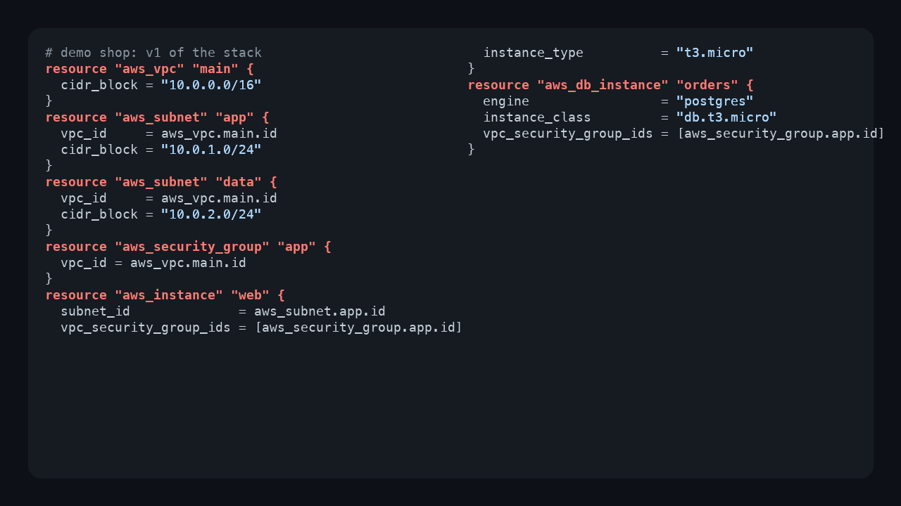
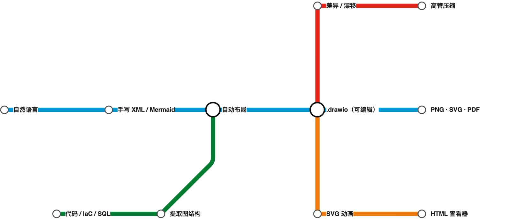

# drawio-skill —— 从文字到专业图表

[](LICENSE)
[](https://github.com/Agents365-ai/drawio-skill/stargazers)
[](https://github.com/Agents365-ai/drawio-skill/network/members)
[](https://github.com/Agents365-ai/drawio-skill/releases/latest)
[](https://github.com/Agents365-ai/drawio-skill/commits/main)

[](https://skillsmp.com/skills/agents365-ai-drawio-skill-skills-drawio-skill-skill-md)
[](https://github.com/Agents365-ai/365-skills)
[](https://agentskills.io)

[English](README.md) · **中文** · [📖 在线文档](https://agents365-ai.github.io/drawio-skill/)

一个把自然语言和真实系统源转换成可持续维护的 `.drawio` 架构模型的技能。除了生成与导出，它还能保留人工布局地增量同步、从同一模型投影多种视图、执行架构规则、查询依赖、模拟故障传播，并发布无外部依赖的互动讲解页。支持 **Claude Code、Cursor、Copilot、OpenClaw、Codex、Autohand Code、Hermes** 等任何兼容 [Agent Skills](https://agentskills.io) 规范的 agent。

<p align="center">
  
</p>

## ✨ 核心亮点

**从一句话开始**

- **描述需求，得到可编辑的 `.drawio`** —— Skill 规划布局、写 XML、导出，然后读取自己的 PNG 自检并自动修复重叠、截断标签、连线堆叠（最多 2 轮），并支持最多 5 轮你的反馈迭代
- **Mermaid → 原生 .drawio**（draw.io ≥ 30）—— 28 种标准类型直接用 Mermaid 文本作图（**mindmap、gantt、timeline、journey、pie、sankey、kanban**……），CLI 原生转成已布局、可编辑的 `.drawio`：只管结构，布局白送
- **白板照片 / 截图 → 可编辑图表** —— 拍下旧 PNG 或实体白板，由视觉模型提取图结构，`raster2drawio.py` 按原布局重建为真正可编辑的 `.drawio`
- **11 种图表类型预设** —— ER 图、UML 类图、序列图、C4、架构图、ML/深度学习、流程图、SysML、BPMN、网络拓扑、跨职能泳道图

**从真实来源生成**

- **可视化代码库** —— Python / JS-TS / Go / Rust 项目的导入关系图与 Python 类继承层级，Graphviz 布点、传递约简、按子包嵌套的容器
- **IaC 与实时基础设施** —— Terraform、Kubernetes、docker-compose 配置直接变成带**官方 AWS / Azure / GCP / K8s 图标**的架构图；也能从 `terraform show -json`、`docker inspect`、`kubectl get -o json` 画出**真正在运行**的东西
- **Schema 与流水线** —— SQL DDL → ER 图，OpenAPI/Swagger → 按 HTTP 方法着色的 API 图，Protocol Buffers → 消息/服务图，GitHub Actions / GitLab CI → 流水线 DAG
- **确定性引擎** —— 序列图自动计算 lifeline 与激活条；多页 C4 模型支持点击下钻

**让图长期保持真实**

- **架构数字孪生 / Diagram IR** —— 图的语义、来源与几何分离；同一模型可生成高管、系统、部署、数据流、安全五种可下钻视图
- **增量同步且不丢人工布局** —— `diagramctl sync` 只更新变化的节点和关系，保留手调坐标、样式与注释；删除项默认进入可审查状态
- **Diagram-as-Test，进 CI** —— YAML/JSON 架构规则（直连数据库、循环依赖、孤立节点、信任边界、对比度……），配官方 GitHub Action 在每个 PR 上强制检查，另有渲染 `.drawio` 的可视 PR diff action
- **查询、体检、What-if** —— 查询组件/owner/调用路径，发现单点与高耦合，模拟节点故障传播，发布无障碍的 Story 讲解页
- **漂移与历史** —— 两张图或两个实时快照的彩色 diff；架构随 git 历史生长的时间轴播放器

**分享与换肤**

- **一条命令二次利用** —— 交互式 HTML 查看器（平移/缩放/搜索）、PowerPoint 演示稿、数据流动画 SVG、Mermaid 或 Markdown 导出、点击式排查手册、高管摘要压缩
- **换肤与增强** —— 样式预设（自定义或内置 `dark`/`corporate`……）、布局不动的双语标签变体、数据驱动的热力图、地铁图模式
- **10,000+ 官方形状 + 321 个 AI/LLM logo** —— 精确解析 AWS / Cisco / K8s / UML 图标 style 而不靠猜，外加 draw.io 自身没有的品牌 logo
- **统一 CLI，可选 MCP 服务** —— `diagramctl doctor/build/sync/views/query/test/review/whatif/story/publish/transform`，核心工作流纯标准库且默认离线；MCP 服务把同样能力暴露给 Claude Desktop、Cursor、VS Code、Codex 等任何 MCP host。可移植到任何兼容 Agent Skills 的 agent，无需常驻服务

## 🗺️ 功能全景

<div align="center">
  
</div>

一张图看全 Skill 的全部能力 —— 图表类型、导入来源、布局引擎、样式、导出格式、二次利用，一目了然。本功能全景图即由 drawio-skill 自身绘制。

## 🚀 安装

### 1. 安装 draw.io 桌面版 CLI

| 平台 | 命令 |
| ------ | ------ |
| **macOS** | `brew install --cask drawio` |
| **Windows** | [下载安装包](https://github.com/jgraph/drawio-desktop/releases) |
| **Linux** | 从 [releases](https://github.com/jgraph/drawio-desktop/releases) 下载 `.deb`/`.rpm`；无头导出需 `sudo apt install xvfb` |

用 `drawio --version` 验证。**推荐 ≥ 30 版本** —— 解锁 Mermaid → `.drawio` 转换和 ELK `--layout` 布局（≤ 29 两者均不可用）。在 **WSL2** 上，CLI 是通过 `/mnt/c` 访问的 Windows 桌面版 exe —— Skill 会自动识别（见[故障排查](skills/drawio-skill/references/troubleshooting.md)）。完整方案见 [docs/INSTALL_CLI_CN.md](docs/INSTALL_CLI_CN.md)。

### 2. 安装技能

```bash
# 任意 Agent（Claude Code、Cursor、Copilot 等）
npx skills add Agents365-ai/365-skills -g
```

```text
# Claude Code 插件市场
> /plugin marketplace add Agents365-ai/365-skills
> /plugin install drawio
```

```bash
# 手动安装
git clone https://github.com/Agents365-ai/drawio-skill.git \
  ~/.claude/skills/drawio-skill

# Autohand Code 全局安装
git clone https://github.com/Agents365-ai/drawio-skill.git \
  ~/.autohand/skills/drawio-skill

# Autohand Code 项目级安装
git clone https://github.com/Agents365-ai/drawio-skill.git \
  .autohand/skills/drawio-skill
```

Autohand Code 也支持通过 `autohand --skill-install` 安装已收录在 Autohand catalog 中的 skill，并可通过 `--project` 安装到当前项目。在该 skill 收录前，请使用上面的直接克隆方式。

同时索引于 [SkillsMP](https://skillsmp.com/skills/agents365-ai-drawio-skill-skills-drawio-skill-skill-md)。

**更新：** `/plugin update drawio`（Claude Code）、`skills update drawio-skill`（SkillsMP），或 `git pull`（手动安装）—— 详见 [docs/INSTALL_SKILL_CN.md#更新](docs/INSTALL_SKILL_CN.md#更新)。版本历史见 [CHANGELOG.md](CHANGELOG.md)。

## ⚡ 快速开始

装好之后直接描述你想要的图表，比如画一个 ML 模型：

```text
画一个用于机器翻译的 Transformer 编码器-解码器：6 层编码器（自注意力），
6 层解码器（交叉注意力），输入嵌入（batch × 512 × 768），位置编码，
最后一层输出投影。在层之间标注张量形状，按层类型配色。
```

Skill 会自动规划布局、生成 `.drawio` XML、导出为你选择的格式、自检结果，并支持后续迭代。

## 🖼️ 示例

<p align="center">
  
</p>

> [!TIP]
> **上面这张架构图就是用下面这条提示词生成的：**

```text
画一个微服务电商架构图，包含 Mobile/Web/Admin 客户端，API Gateway（含认证+限流+路由），
Auth/User/Order/Product/Payment 微服务，Kafka 消息队列，Notification 服务，
以及 User DB / Order DB / Product DB / Redis Cache / Stripe API
```

可维护的 [Architecture Studio 演示](examples/architecture-studio/) 覆盖代码 →
IR → `.drawio`、保留人工布局的冲突感知同步，以及架构模型 →
规则/多视图/What-if/无障碍 Story。所有产物都由一条脚本重建并纳入测试。

Skill 在多种图表拓扑中尽量保持线条清晰路由，避免穿越无关形状：

<table>
  <tr>
    <td align="center" width="33%">
      <br>
      <b>星形</b> · 7 个节点<br>
      <sub>中央消息代理 + 6 个微服务辐射排列，本例中线条零交叉。</sub>
    </td>
    <td align="center" width="33%">
      <br>
      <b>分层</b> · 10 节点 / 4 层<br>
      <sub>电商架构，同层水平 + 对角线交叉连线均通过路由走廊绕行。</sub>
    </td>
    <td align="center" width="33%">
      <br>
      <b>环形</b> · 8 个节点<br>
      <sub>CI/CD 流水线，含闭合回路和 2 个分支，沿矩形外围流动。</sub>
    </td>
  </tr>
</table>

它也懂 **Mermaid** —— 标准图类型（流程图、思维导图、**看板**、gitGraph、时间线…）可直接转成原生、可编辑的 `.drawio`。下面是一块看板（本项目自己的路线图），由几行 Mermaid 生成：

<div align="center">
  
</div>

**Tube-Map 模式** 把流水线或旅程重绘成伦敦地铁风格的线路图 —— 彩色线路、八向（水平/垂直/45°）路由、白色换乘圈。下面是 skill 自己的处理流程（这张图就是 `assets/tubemap-cn.json`，约 20 行）：

<div align="center">
  
</div>

完整演练见 [docs/USAGE_CN.md](docs/USAGE_CN.md)。

## 🗺️ 从真实来源到图表

除了手写图表，Skill 还能把**现有代码、基础设施和 schema 变成图表** —— 无需手动摆坐标。直接说：

> *"可视化这个 Python 项目的模块结构"* · *"画出 `mypackage` 的类继承层级"*

<p align="center">
  
</p>

<sub>↑ Python <code>logging</code> 包的类继承层级 —— 一条命令生成，模块自动分框，每条继承边都被解析。</sub>

幕后是一条 提取器 → 自动布局 → 校验 的流水线：

```bash
# 源码 -> graph JSON -> 已布局、可编辑的 .drawio
python3 scripts/tfimports.py ./infra -o graph.json          # Terraform -> 官方 AWS 图标
python3 scripts/autolayout.py graph.json -o architecture.drawio

# 两个状态之间的漂移，然后发布成一个交互式文件
python3 scripts/drawiodiff.py v1.drawio v2.drawio -o drift.json
python3 scripts/drawiohtml.py architecture.drawio -o architecture.html
```

按阶段分组的完整工具箱：

| 阶段 | 工具 |
| --- | --- |
| **导入** | 14 个提取器：**Python · JS/TS · Go / Rust** 导入关系图、**Python 类继承**、**Terraform / Kubernetes / docker-compose**（官方云图标）、从 `terraform show -json` / `docker inspect` / `kubectl get -o json` 提取的**实时**基础设施、**SQL DDL → ER 图**、**OpenAPI → API 图**（按 HTTP 方法着色）、**Protobuf → 消息/服务图**、**GitHub Actions + GitLab CI → DAG** |
| **对比与演进** | `drawiodiff.py` 用颜色标出两张图或两个实时快照的漂移（新增=绿、删除=红、变更=橙）；`timelapse.py` 把 git 历史重放成 HTML 播放器；`prdiff.py` 在 CI 里渲染 PR diff |
| **二次利用** | `explain.py` → Markdown，`drawiohtml.py` → 平移缩放搜索的 HTML 查看器，`drawio2pptx.py` → 演示稿，`svgflow.py` → 动画 SVG，`drawio2mermaid.py` → diagrams-as-code，`runbook.py` → 点击式排查应用，`compress.py` → 可下钻的高管摘要，`buildup.py` → 自动绘制播放器，`tubemap.py` → 地铁图 |
| **换肤与增强** | `restyle.py` 按色相重映射应用预设，`relabel.py` 布局不动地生成翻译变体，`heatmap.py` 按指标 CSV/JSON 给节点上色，`edgeports.py` 解开形状边界上堆叠的连线 |
| **布局与校验** | `autolayout.py`（Graphviz 布点、正交路由、`--tune` 自动选方向、`--group` 容器、传递约简：asyncio 149 → 46 条边）、`seqlayout.py`、`c4.py`，以及确定性 `validate.py` linter（`--score` / `--strict`） |

布局需要 Graphviz（`brew install graphviz` / `apt install graphviz`）—— 可选，其余功能无需它。完整格式与参数见 [references/autolayout.md](skills/drawio-skill/references/autolayout.md)，全部工具见 [references/toolbox.md](skills/drawio-skill/references/toolbox.md)。在 CI 中重新生成、校验（`--strict` 门禁）并无头渲染：[docs/CI_CN.md](docs/CI_CN.md)。

## 🧩 支持的图表类型

| 类别 | 示例 | 特色 |
| ------ | ------ | ------ |
| 架构图 | 微服务、云（AWS/GCP/Azure）、网络拓扑、部署 | 分层泳道、hub 居中策略 |
| C4 模型 | 系统上下文、容器、组件 | 多页 `.drawio`、点击下钻链接 |
| ML / 深度学习 | Transformer、CNN、LSTM、GRU | 张量形状标注、层类型配色 |
| 流程图 | 业务流程、工作流、决策树、状态机 | 语义形状（平行四边形 I/O、菱形判断） |
| UML | 类图、序列图 | 继承 / 组合 / 聚合箭头；生命线 + 激活框 |
| SysML / MBSE | 模块定义图（bdd）、内部模块图（ibd）、需求图（req）、参数图（par） | «block» / «requirement» 分栏、satisfy/derive/verify 依赖边、原生 `mxgraph.sysml.*` 端口与流 |
| BPMN | 业务流程、泳池与泳道 | 原生 `mxgraph.bpmn.*` 事件/任务/网关，顺序流 vs 消息流 |
| 网络拓扑 | LAN/WAN、子网、DMZ | `mxgraph.networks.*` 设备形状、区域容器、链路标注；Cisco/机架经形状搜索 |
| 跨职能泳道图 | 谁在哪步做什么、交接流程 | 泳池 + 角色泳道、流程图形状、正交交接边 |
| 数据图 | ER 图、数据流图（DFD） | 表容器、PK/FK 标记 |
| Mermaid 作图 | 思维导图、甘特图、timeline、journey、饼图、桑基图、看板等 28 种 | CLI（≥ v30）原生转换 —— 只写结构，布局白送 |
| 其他 | 组织架构图、线框图 | — |

## 🔍 形状搜索

需要真实的 AWS / Azure / GCP / Cisco / Kubernetes / UML / BPMN 图标？Skill 会在 **10,000+ 个官方 draw.io 形状**中搜出精确的 style 字符串 —— 厂商图标正确渲染，而不是因为猜错 `shape=mxgraph.*` 名称而退化成空白方框。

> *"加一个 AWS Lambda 连到 S3 桶"* · *"用真正的 Kubernetes pod 图标"*

```bash
python3 scripts/shapesearch.py "aws lambda" --limit 5
# → Lambda (77x93)
#   outlineConnect=0;...;shape=mxgraph.aws3.lambda;fillColor=#F58534;...
```

<p align="center">
  
</p>

<sub>↑ 一张 AWS 无服务器架构图 —— 每个图标都是 <code>shapesearch.py</code> 解析出的真实官方 draw.io 形状，而非手猜的 <code>shape=</code> 字符串。</sub>

覆盖 AWS / Azure / GCP / Cisco / Kubernetes / UML / BPMN / ER / 电气 / P&ID 以及通用形状集。可手写的 style 速查表 + 搜索用法见 [references/shapes.md](skills/drawio-skill/references/shapes.md)。

## 🤖 AI / LLM 品牌图标

draw.io **没有**任何现代 AI/LLM 品牌图标，所以画 LLM 应用架构时只能是一堆方框。`aiicons.py` 能把品牌名解析成 draw.io 图片样式，覆盖 [lobe-icons](https://github.com/lobehub/lobe-icons)（MIT）的 **321 个图标**（OpenAI、Claude、Gemini、Mistral、Llama、Cohere、DeepSeek、Qwen、Ollama、LangChain、HuggingFace……），并经 [simple-icons](https://simpleicons.org)（CC0）补充 **18 个数据存储品牌**（Redis、Postgres、MongoDB、Qdrant、Milvus、Supabase……），适合 RAG 架构图。

```bash
python3 scripts/aiicons.py "claude" --json      # CDN 引用（默认）
python3 scripts/aiicons.py "openai" --embed     # 内联为自包含 data URI
```

<p align="center">
  
</p>

<sub>↑ 一张多供应商 LLM 应用图 —— 每个品牌 logo 都由 <code>aiicons.py</code> 解析。默认从 unpkg CDN 引用图标（渲染时需联网），<code>--embed</code> 可内联以离线使用。logo 为各自所有者的商标，仅用于标识。</sub>

## 🎨 样式预设

把视觉风格"教"给 Skill 一次，所有图表自动复用。内置五种预设：`default`、`corporate`、`handdrawn`、`colorblind-safe`（Okabe-Ito 色盲安全色板）、`dark`；也可以从 `.drawio` 文件或图片学习你的风格：

```text
画一个微服务架构图，使用我的 "corporate" 样式
```

```text
从 ~/diagrams/brand.drawio 学习我的样式，保存为 "mybrand"
```

Skill 会提取配色、形状、字体和连线风格，渲染预览图，**确认后**才保存预设。完整管理命令见 [docs/STYLE_PRESETS_CN.md](docs/STYLE_PRESETS_CN.md)。

## 🔄 工作流程

<p align="center">
  
</p>

幕后流程：**检查依赖 → 规划布局 → 生成 `.drawio` XML → 导出草稿 PNG → 自检 + 自动修复**（最多 2 轮）→ **展示给用户 → 5 轮反馈循环**直到满意 → **最终导出**。

## 🆚 对比

### 对比其他 draw.io Skills 与工具

| 功能 | drawio-skill | [jgraph/drawio-mcp](https://github.com/jgraph/drawio-mcp)（官方）<br> | [bahayonghang/drawio-skills](https://github.com/bahayonghang/drawio-skills)<br> | [GBSOSS/ai-drawio](https://github.com/GBSOSS/ai-drawio)<br> |
| ------ | ------ | ------ | ------ | ------ |
| **方式** | 纯 SKILL.md + 可选 MCP 服务 | MCP 服务 / Claude Code 插件 / Project | YAML DSL + CLI（MCP 可选） | Claude Code 插件 |
| **依赖** | 仅 draw.io 桌面版 | draw.io 桌面版 | draw.io 桌面版（MCP 可选） | draw.io 插件 + 浏览器 |
| **多智能体支持** | ✅ 6 个平台 | ⚠️ MCP 宿主（Claude、Cursor、VS Code） | ✅ Claude / Gemini / Codex | ❌ 仅 Claude Code |
| **自检 + 自动修复** | ✅ 2 轮（读取 PNG） | ❌ | ✅ 校验 + 严格模式 | ❌ 仅截图 |
| **迭代审查** | ✅ 5 轮循环 | ❌ 一次生成 | ✅ 3 种工作流 | ❌ |
| **图表预设** | ✅ 7 种 | ❌ | ✅ 论文模式分类 | ❌ |
| **Mermaid 作图** | ✅ 28 种（CLI ≥ 30） | ✅ | ❌ | ❌ |
| **ML/DL 图** | ✅ 张量标注、层配色 | ❌ | ❌ | ❌ |
| **配色系统** | ✅ 7 色语义 | ❌ | ✅ 6 种主题 | ❌ |
| **官方形状搜索** | ✅ 1 万+ 形状（本地） | ✅ 1 万+ 形状（MCP） | ❌ | ❌ |
| **AI/LLM 品牌图标** | ✅ 321 + 18 数据存储 | ❌ | ❌ | ❌ |
| **浏览器降级** | ✅ diagrams.net URL（查看 + 可编辑） | ✅ diagrams.net URL（插件）+ 内联预览 | ✅ 通过可选 MCP | ✅ diagrams.net viewer（主要） |
| **零配置** | ✅ 复制 `skills/drawio-skill/` | ✅ | ✅ 桌面版模式 | ❌ 需安装插件 |

> **在用官方 jgraph 插件？** [jgraph/drawio-mcp](https://github.com/jgraph/drawio-mcp) 现已提供官方 Claude Code 插件（`/plugin install drawio@drawio`），同样生成 `.drawio` 并通过桌面版 CLI 导出。drawio-skill 与之互补 —— 当你需要代码 / IaC / SQL / OpenAPI / Protobuf 导入器、AI 品牌图标、确定性时序图与 C4 生成器、自检 + 审查循环以及交互式 HTML 查看器，且只想用单个 SKILL.md、无需 MCP 服务时，选它。

完整对比 + 核心优势总结见 [docs/COMPARISON_CN.md](docs/COMPARISON_CN.md)（含核查时间戳）。

## 🎯 何时用(以及何时别用)

**适合:**

- 精致、精确的图 —— 汇报/决策用图、架构图、网络拓扑、严格 UML、ER 图
- 不透明实色填充、10,000+ 官方图形、品牌图标(AWS / Azure / GCP / Cisco / Kubernetes + AI/LLM logo)、泳道、自定义几何
- 需要导出 PNG / SVG / PDF 且保持可编辑的场景

**这些情况请改用同系列的其它 skill:**

- **随性的手绘 / 白板观感** → [excalidraw-skill](https://github.com/Agents365-ai/excalidraw-skill) 或 [tldraw-skill](https://github.com/Agents365-ai/tldraw-skill)
- **以代码形式存进 git、在 Markdown 里渲染的图** → [mermaid-skill](https://github.com/Agents365-ai/mermaid-skill)(通用)或 [plantuml-skill](https://github.com/Agents365-ai/plantuml-skill)(UML)
- **无限画布自由涂鸦 / 自由笔迹** → [tldraw-skill](https://github.com/Agents365-ai/tldraw-skill)

## 🔗 相关 Skill

[Agents365-ai 图表 skill 家族](https://github.com/Agents365-ai) 一员 —— 按场景挑工具：

| Skill | 风格 | 适用场景 |
| --- | --- | --- |
| [excalidraw-skill](https://github.com/Agents365-ai/excalidraw-skill) | 手绘 / 草图 | 白板原型、非正式图 |
| [mermaid-skill](https://github.com/Agents365-ai/mermaid-skill) | 文本驱动、自动布局 | 可嵌入 README、易于版本管理 |
| [plantuml-skill](https://github.com/Agents365-ai/plantuml-skill) | UML 专精 | CI 流水线里的类图 / 序列图 |
| [tldraw-skill](https://github.com/Agents365-ai/tldraw-skill) | 白板协作 | 随手画、FigJam 风格 |

## 👤 作者

**Agents365-ai**

- GitHub: <https://github.com/Agents365-ai>
- Bilibili: <https://space.bilibili.com/441831884>

## 📄 许可证

[MIT](LICENSE)
